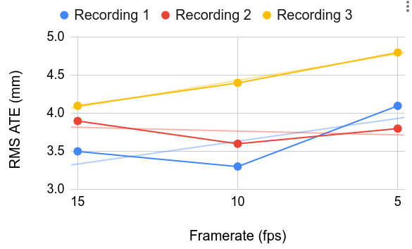

# Summer Internship: Weekly Progress Reports

## Week 1

This week, I worked on running MPS on lower-framerate recordings.

- Used hacky way to decrease framerate of file:

  ```python
  os.system(f"vrs copy 30fps.vrs --to frame{i}.vrs --around {current_time} 0.02 > /dev/null")
  ```

  By adjusting the time range so that exactly one frame would go into the output
  file, a selected subset of the frames could then be merged into a file that
  had a lower framerate.

- Then, MPS flagged the file as having half of the frames dropped, because
  of a metadata tag in the file telling it that half of the frames were dropped.
- I ended up modifying some sample code in the repo to change the metadata tag
  using the `->set()` API:

```cpp
 void doDataLayoutEdits(const CurrentRecord& record, size_t blockIndex, DataLayout& dl) override {
    if (record.recordType == Record::Type::CONFIGURATION) {
      const auto& newSpec = getExpectedLayout<ImageSpec>(dl, blockIndex);
      dl.findDataPieceValue<double>("nominal_rate")->print(std::cout, "");
      // cout << "Patching value" << "\n";
      // double x = 15;
      double rate;
      cin >> rate;
      dl.findDataPieceValue<double>("nominal_rate")->set(rate);
      // cout << "Patching value complete" << "\n";
      dl.findDataPieceValue<double>("nominal_rate")->print(std::cout, "");
    }
  }
```

## Week 2

- Using the techniques developed the previous week, I was able to run MPS on
  three sequences to compare the results:
  
- I also refactored the scripts in my codebase to eliminate hardcoded values
  (which I put in previously as I was trying to get a single working instance).
  An example is the Python script to extract the necessary subset of frames out of
  the dataset recording:

```python
import os
os.system("vrs 30fps.vrs + 1201-2 | tail -n 1")
num_frames = int(input("How many frames? "))
time_per_frame = float(input("What is your target FPS? Must be a divisor of \
30: "))
num_frames = num_frames * time_per_frame / 30
num_frames += 3
os.system("vrs 30fps.vrs + 1201-2 | tail -n 1")
current_time = float(input("Current time: "))
num_frames = int(num_frames)
print(time_per_frame)
print(num_frames)
input()
for i in range(num_frames):
    if i == 0:
        lower_bound = 0
    else:
        lower_bound = current_time - 0.02 # appropriate time window for 30fps
    upper_bound = current_time + 0.02
    os.system(f"vrs copy 30fps.vrs --to frame{i}.vrs --around {current_time} 0.02 > /dev/null")
    os.system("clear")
    print(current_time)
    if i % 150 == 0:
        print(current_time)
        os.system(f"vrs frame{i}.vrs + 1201-2 | tail -n 1")
        current_time = float(input("What time is it? "))
    current_time += 1 / time_per_frame
```

- Presentation this week:
<iframe src="https://docs.google.com/presentation/d/e/2PACX-1vR_cLud0nuOIFRterRV6IEc492I1zLgn_KeMaCOzJEN0q71m3Oelrj7p_88fSRi3fdLjFOIN63Aqq8_/pubembed?start=false&loop=false&delayms=3000" frameborder="0" width="960" height="569" allowfullscreen="true" mozallowfullscreen="true" webkitallowfullscreen="true"></iframe>

## Week 3

This week, I moved away from MPS and tried to run ORB-SLAM3.

- I found [Egocentric
  Splats](https://github.com/facebookresearch/egocentric_splats), which was very
  useful because the preprocessing script rectified the Fisheye624-calibrated images
  to pinhole.
  
- Presentation this week:
<iframe src="https://docs.google.com/presentation/d/e/2PACX-1vTSYHJBDJiIqnvgN_qvrfBAPrc3ZtIv5iW3AHEHae42XHKt6mq9McFcmYdvVu9k7PSsjj6KCEathNCE/pubembed?start=false&loop=false&delayms=3000" frameborder="0" width="960" height="569" allowfullscreen="true" mozallowfullscreen="true" webkitallowfullscreen="true"></iframe>

## Week 4

- Using the pinhole-rectified images, I (with some Gemini to help extract the
params) got this
calibration file:

```yaml

Camera.type: "PinHole"

Camera1.fx: 1200.0
Camera1.fy: 1200.0
Camera1.cx: 1199.5
Camera1.cy: 1199.5

Camera1.k1: 0.000
Camera1.k2: 0.000
Camera1.p1: 0.000
Camera1.p2: 0.000

Camera.width: 2400
Camera.height: 2400

Camera.newWidth: 600
Camera.newHeight: 600
Camera.fps: 15

Camera.RGB: 1

IMU.T_b_c1: !!opencv-matrix
   rows: 4
   cols: 4
   dt: f
   data: [0.096069622099, 0.777188953575, -0.621890631985, -0.011539435317,
          0.994493238815, -0.101231365144, 0.027118419253, -0.005419289842,
       -0.041878701764, -0.621071285081, -0.782634418606, -0.000644298931,
        0.000000000000, 0.000000000000, 0.000000000000, 1.000000000000]

IMU.NoiseGyro: 1e-3
IMU.NoiseAcc: 1e-2
IMU.GyroWalk: 1e-7
IMU.AccWalk: 1e-7
IMU.Frequency: 794.55
```
